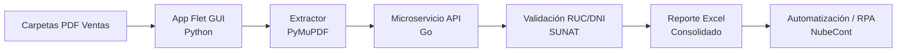

# NubeCont Automatización SUNAT

Sistema de escritorio que automatiza el registro de **Ventas** en NubeCont: extrae datos de facturas y boletas PDF, valida RUC/DNI en tiempo real contra SUNAT y genera reportes Excel listos para importación masiva.

> [!NOTE]
> Este proyecto se centra **exclusivamente en el Registro de Ventas**. El flujo de Compras se gestiona de forma independiente en otro proyecto mediante lectura OCR.

---

## Problema

El registro contable de comprobantes de venta en NubeCont mediante procesos manuales genera ineficiencias importantes:

- **Lentitud y alto margen de error** al digitar montos, IGV, fechas, series y correlativos.
- **Inconsistencia de datos**: la consulta interna de NubeCont utiliza registros desactualizados. En muchos casos marca como "Habilitado" o "Activo" a RUC/DNI que en el portal oficial de SUNAT figuran con otra condición (Baja, No Habido, etc.), generando contingencias tributarias.

## Solución

Aplicación de escritorio desacoplada mediante un microservicio en Go que:

1. Extrae datos de facturas y boletas electrónicas en PDF.
2. Realiza **validación directa y en tiempo real** de RUC/DNI contra SUNAT.
3. Genera reportes Excel estructurados listos para automatización e importación masiva en NubeCont.

---

## Tech Stack

| Componente              | Tecnología           | Uso                                                       |
| ----------------------- | -------------------- | --------------------------------------------------------- |
| Frontend / GUI          | Python 3.12+ + Flet  | Interfaz gráfica ligera e intuitiva                       |
| Gestión de dependencias | uv                   | Entornos virtuales y paquetes de alta velocidad           |
| Extracción PDF          | PyMuPDF + Pandas     | Lectura de PDFs y estructuración de Excel                 |
| Backend                 | Go (Golang)          | Microservicio de consultas masivas y concurrentes a SUNAT |
| Pruebas de API          | Bruno                | Documentación y pruebas de endpoints                      |
| Automatización externa  | Power Automate / RPA | Llenado automático de formularios en NubeCont             |

---

## Características Principales

- **Filtro de Comprobantes de Venta** — Procesamiento ágil de Facturas y Boletas electrónicas.
- **Validación SUNAT en Tiempo Real** — Consulta masiva de RUC y DNI con el estado real (Activo/Habido) directamente desde la fuente oficial.
- **Ejecutable Portable** — Disponible en `app/dist/NubeContSUNAT.exe` sin necesidad de instalar dependencias.
- **Estructuración para NubeCont** — Genera data organizada para alimentar flujos de automatización e ingreso de clientes.

---

## Requisitos

> [!TIP]
> Si solo vas a usar el ejecutable portable (`.exe`), **no necesitas instalar ningún entorno de desarrollo**.

### Para desarrollo (código fuente)

- [Python 3.12+](https://www.python.org/)
- [uv](https://docs.astral.sh/uv/)
- [Go](https://go.dev/)

### Notas operativas

1. **Binario de la API Go**  
   El ejecutable compilado (`api_sunat.exe` en Windows o `api_sunat` en Linux/macOS) debe estar ubicado en la raíz del proyecto. `main.py` lo gestiona automáticamente en segundo plano.

2. **Pre-registro en NubeCont**  
   Para ejecutar flujos posteriores de automatización (Power Automate u otros RPA), es necesario haber registrado previamente los RUC/DNI de los clientes consultados.

---

## Desarrollo y Ejecución

### 1. Aplicación Principal (Python + Flet)

```bash
cd app
uv sync                    # Sincronizar e instalar dependencias
python -m pytest           # Ejecutar pruebas unitarias
uv run .\main.py           # Ejecutar en modo desarrollo
```

### 2. Microservicio API (Go)

```bash
cd api-app
go run main.go
```

### 3. Generar ejecutable portable

Ejecutable para la api integrarlo a app

```bash
cd api-app
go build -o ../api_sunat.exe
```

El archivo se generará en app/dist/NubeContSUNAT.exe.

```bash
cd app
pyinstaller --noconsole --onefile main.py -n "NubeContSUNAT"
```

> [!NOTE]
> El repositorio incluye una colección de **Bruno** para probar de forma directa los endpoints del microservicio.

---

## Flujo de Trabajo



---
